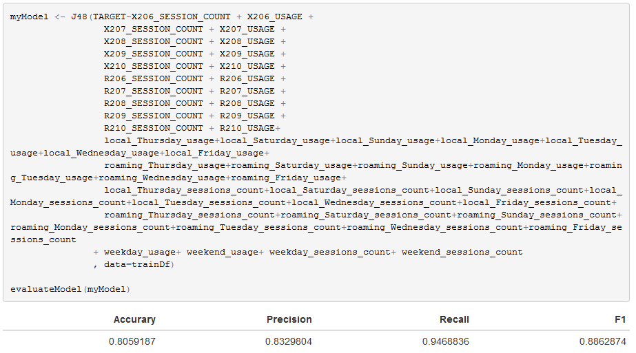
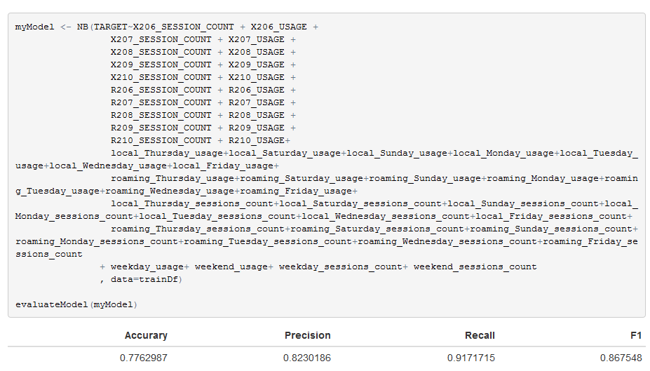

#Initial exploration (Amir)
We begin by attaching required libraries and loading the datasets and relevant classifiers.
```{r message=FALSE}
library(dplyr)
library(knitr)
library(RWeka)
library(tidyr)
library(ggplot2)
```
```{r cache=TRUE}
trainDf <- read.csv('data/train.csv')
testDf <- read.csv('data/test.csv')
contractRefDf <- read.csv('data/contract_ref.csv')
calendarRefDf <- read.csv('data/calendar_ref.csv')
dailyAggDf <- read.csv('data/daily_aggregate.csv')
roamingDf <- read.csv('data/roaming_monthly.csv')
```
```{r}
trainDf$TARGET <- as.factor(trainDf$TARGET)
RF <- make_Weka_classifier("weka/classifiers/trees/RandomForest")
NB <- make_Weka_classifier("weka/classifiers/bayes/NaiveBayes")
MLP <- make_Weka_classifier("weka/classifiers/functions/MultilayerPerceptron")
```
## Train and Test datasets
We proceed by taking a look at the training and test datasets:
```{r}
trainDf %>% dim
trainDf$CONTRACT_KEY %>% unique %>% length
trainDf %>% summary
sapply(trainDf, function(x) sum(is.na(x)))
testDf %>% dim
testDf$CONTRACT_KEY %>% unique %>% length
testDf %>% summary
sapply(testDf, function(x) sum(is.na(x)))
```
There are no NA values in the original train and test datasets, and no multiple observations for the same `CONTRACT_KEY`. Now, we proceed by temporarily adding two features to both datasets, and deriving some insight from them.
```{r}
tmpTrain <- trainDf
tmpTest <- testDf
trainDf <- trainDf %>% mutate(TOTAL_USAGE = X206_USAGE + X207_USAGE + X208_USAGE + X209_USAGE + X210_USAGE, TOTAL_SESSION_COUNT = X206_SESSION_COUNT + X207_SESSION_COUNT + X208_SESSION_COUNT + X209_SESSION_COUNT + X210_SESSION_COUNT)
testDf <- testDf %>% mutate(TOTAL_USAGE = X206_USAGE + X207_USAGE + X208_USAGE + X209_USAGE + X210_USAGE, TOTAL_SESSION_COUNT = X206_SESSION_COUNT + X207_SESSION_COUNT + X208_SESSION_COUNT + X209_SESSION_COUNT + X210_SESSION_COUNT)
```
Now we define two helper functions. The function `targetPercentCalculator` returns the percentage of users in the trainDf between a given minimum and maximum thresholds for total usage, that have the input target (0 or 1).
```{r}
targetPercentCalculator <- function(target, minThreshold, maxThreshold) {
  tmp <- trainDf %>% filter(TOTAL_USAGE > minThreshold & TOTAL_USAGE < maxThreshold) %>% group_by(TARGET) %>% summarize(sum=n())
  tmp[tmp$TARGET==target,"sum"][[1]] * 100 / (tmp[tmp$TARGET==1 - target,"sum"][[1]] + tmp[tmp$TARGET==target,"sum"][[1]])
}
```
The function `usagePercentCalculator` returns the percentage of users from the trainDf whose user consumption is between the given thresholds.
```{r}
usagePercentCalculator <- function(minThreshold, maxThreshold) {
  (trainDf %>% filter(TOTAL_USAGE > minThreshold & TOTAL_USAGE < maxThreshold ) %>% nrow) * 100 / (trainDf %>% nrow)
}
```
Now using the previous two functios, we take a look at some properties of the data:
```{r}
targetPercentCalculator(0,0,100)
usagePercentCalculator(0,100)
```
Users whose total consumption is betweeen 0 and 100 MB make about 17% of the train data, and 99.6% of them have target 0.
```{r}
targetPercentCalculator(0,0,500)
usagePercentCalculator(0,500)
```
Users whose total consumption is betweeen 0 and 500 MB make about 23% of the train data, and 98.65% of them have target 0.
```{r}
targetPercentCalculator(0,0,2000)
usagePercentCalculator(0,2000)
```
Users whose total consumption is betweeen 0 and 2000 MB make about 40% of the train data, and 95.5% of them have target 0.
```{r}
targetPercentCalculator(0,0,5000)
usagePercentCalculator(0,5000)
```
Users whose total consumption is betweeen 0 and 5000 MB make about 57% of the train data, and 90% of them have target 0.
```{r}
trainDf <- tmpTrain
testDf <- tmpTest
rm(tmpTrain, tmpTest)
```

## ContractRef dataset
We now proceed with examiming the `contract_ref` dataset.
```{r}
contractRefDf %>% dim
contractRefDf$CONTRACT_KEY %>% unique %>% length
```
No multiple observations for the same `CONTRACT_KEY`.
```{r}
sapply(contractRefDf, function(x) sum(is.na(x)))
contractRefDf %>% summary
```
Some weird observations are spotted in this examination:
### Unnaturally small age values
```{r}
contractRefDf[contractRefDf$AGE < 15,]
```
There are 5 observations with a negative age, which is impossible. Also, there are 7 observations with suspiciously small ages ranging from 1 to 4 years.

### Age values of `99`
```{r}
contractRefDf[contractRefDf$AGE == 99,] %>% nrow
```
Almost half the observations in this dataset (51263 out of 107743) have an age value of `99`, which could be a default value for unknown or not entered ages.

###Incomplete `GENDER` observations
More than half the oservations (54379 out of 107743) have missing gender values labeled as `Not Entered`, while 3148 observations have gender values labeled as `Unknown`.
```{r}
length(intersect(unique(trainDf$CONTRACT_KEY),unique(contractRefDf[contractRefDf$GENDER == "Not Entered",]$CONTRACT_KEY)))
length(intersect(unique(testDf$CONTRACT_KEY),unique(contractRefDf[contractRefDf$GENDER == "Not Entered",]$CONTRACT_KEY)))
```
The missing observations are not tied to customers of train dataset only or test dataset only as shown above.
```{r}
contractRefDf$GENDER %>% unique
```
Moreover, the male gender has multiple labels (`Male`, `M` & `m`), as well as the female gender (`Female`, `F` & `f`).

###NAs in `VALUE_SEGMENT`
There are 6 NA observations in the `VALUE_SEGMENT` column, as well as 8169 values of "N/A" which are basically the same as NA values. So, these are all missing values.

##Roaming dataset
```{r}
roamingDf %>% dim
roamingDf$CONTRACT_KEY %>% unique %>% length
roamingDf %>% summary
sapply(roamingDf, function(x) sum(is.na(x)))
```
No weird observations here. The number of observations is greater than the number of unique customers because each customer can have multiple entries concerning different months.

##CalendarRef dataset
```{r}
calendarRefDf %>% dim
calendarRefDf$DATE_KEY %>% unique %>% length
calendarRefDf %>% summary
sapply(calendarRefDf, function(x) sum(is.na(x)))
```
An interesting observation here is that there are 183 different dates although we only need 29 dates representing the last month in our data which is February 2016.

##Daily aggregate dataset
```{r cache=TRUE}
dailyAggDf %>% dim
dailyAggDf$CONTRACT_KEY %>% unique %>% length
length(intersect(unique(trainDf$CONTRACT_KEY),unique(dailyAggDf$CONTRACT_KEY)))
length(intersect(unique(testDf$CONTRACT_KEY),unique(dailyAggDf$CONTRACT_KEY)))
dailyAggDf %>% summary
sapply(dailyAggDf, function(x) sum(is.na(x)))
```
The daily aggregate dataframe has 4985457 observations that belong to 30995 different customers. Out of those customers, 21708 reside in the training dataset while the remaining 9287 reside in the testing dataset.
```{r}
calendarRefDf[calendarRefDf$DATE_KEY==6337,]
calendarRefDf[calendarRefDf$DATE_KEY==6365,]
```
The min and max date keys correspond to the first and last days of February 2016 respectively. This indicates that the date keys are relatively ordered with respect to the dates.  
Now we proceed to validate the observations in the daily aggregate dataset with what we already know from the monthly datasets. We randomly choose user with `CONTRACT_KEY`=`150761380` to study on.
```{r}
trainDf[trainDf$CONTRACT_KEY==150761380,c("X210_USAGE", "X210_SESSION_COUNT")]
dailyAggDf[dailyAggDf$CONTRACT_KEY==150761380,]$NO_OF_SESSIONS %>% sum
```
We find that the sum of number of sessions of all days is indeed the total number of sessions in the last month.
```{r}
dailyAggDf[dailyAggDf$CONTRACT_KEY==150761380,]$TOTAL_CONSUMPTION %>% sum
```
However, the sum of total consumption all days does not match the monthly usage value. If we divide the sum by (1024 * 1024) and round up we get a matching value. 
```{r}
735391744 / (1024 * 1024)
```
This indicates that the daily consumption was in bytes and what we did now was converting it to MB.

# Visualizations (Mimi)
We examine the graph for sample of users' usage where the target is 1 and 0
```{r}
monthly_names <- c('206','207','208','209','210')
monthly_usage_columns <- c('X206_USAGE','X207_USAGE','X208_USAGE','X209_USAGE','X210_USAGE')
avgs_monthly_usages <- c(mean(trainDf$X206_USAGE),mean(trainDf$X207_USAGE),mean(trainDf$X208_USAGE),mean(trainDf$X209_USAGE),mean(trainDf$X210_USAGE))

trainDfTarget1 <- trainDf %>% filter(TARGET == 1)
trainDfTarget0 <- trainDf %>% filter(TARGET == 0)

avgs_monthly_usages_traget_1 <- c(mean(trainDfTarget1$X206_USAGE),mean(trainDfTarget1$X207_USAGE),mean(trainDfTarget1$X208_USAGE),mean(trainDfTarget1$X209_USAGE),mean(trainDfTarget1$X210_USAGE))

avgs_monthly_sessions_count_traget_1 <- 
c(mean(trainDfTarget1$X206_SESSION_COUNT),mean(trainDfTarget1$X207_SESSION_COUNT),mean(trainDfTarget1$X208_SESSION_COUNT),mean(trainDfTarget1$X209_SESSION_COUNT),mean(trainDfTarget1$X210_SESSION_COUNT))

avgs_monthly_usages_target_0 <- c(mean(trainDfTarget0$X206_USAGE),mean(trainDfTarget0$X207_USAGE),mean(trainDfTarget0$X208_USAGE),mean(trainDfTarget0$X209_USAGE),mean(trainDfTarget0$X210_USAGE))

avgs_monthly_sessions_count_traget_0 <- c(mean(trainDfTarget0$X206_SESSION_COUNT),mean(trainDfTarget0$X207_SESSION_COUNT),mean(trainDfTarget0$X208_SESSION_COUNT),mean(trainDfTarget0$X209_SESSION_COUNT),mean(trainDfTarget0$X210_SESSION_COUNT))

df <- data.frame(monthly_names, avgs_monthly_usages_traget_1, avgs_monthly_usages_target_0, avgs_monthly_sessions_count_traget_1, avgs_monthly_sessions_count_traget_0)
```

From the figure below we can have two observaitions:
  1. The value is 1 when the rate of changes tends to increase over the 5 months.
  2. The value is 1 for the users who used big usages in the last 5 months(roughly greater than 2500MB).
  
```{r}
ggplot(df, aes(monthly_names)) + 
  geom_line(aes(y = avgs_monthly_usages_traget_1, colour='1'), size=1.5, group = 1) + 
  geom_line(aes(y = avgs_monthly_usages_target_0, colour= '0'), size= 1.5, group = 1) + 
  xlab("Month")+ylab("Mean Usage")  +
  scale_colour_manual(values=c("#F57670","#C680FC"))
```
The same as the mean for usage when the target is 1 However, we can notice that bump in the middle of the users where the target is 0.
```{r}
ggplot(df, aes(monthly_names)) + 
  geom_line(aes(y = avgs_monthly_sessions_count_traget_1, colour='1'), size=1.5, group = 1) + 
  geom_line(aes(y = avgs_monthly_sessions_count_traget_0, colour= '0'), size= 1.5, group = 1) + 
  xlab("Month")+ylab("Mean Session Count")  +
  scale_colour_manual(values=c("#F57670","#C680FC"))

trainDf <- trainDf %>% rowwise() %>% mutate(diff1 = X207_USAGE - X206_USAGE, diff2 = X208_USAGE-X207_USAGE, diff3=X209_USAGE-X208_USAGE,diff4=X210_USAGE-X209_USAGE, always_increasing = (diff1 > 0 & diff2 > 0 & diff3 >0 & diff4 > 0))
```

#Offline Evaluation
Due to the limited number of possible submissions per day on the kaggle competition, a method for offline evaluation of our obtained models was necessary. Two helper functions serve that purpose. The function `getEvaluation` extracts the required classification evaluation measures from a given confusion matrix.
```{r}
getEvaluation <- function(confMat) {
  tp <- confMat[1,1]
  fn <- confMat[1, 2]
  fp <- confMat[2, 1]
  tn <- confMat[2, 2]
  Accurary <- (tp + tn) / (tp + fn + fp + tn)
  Precision <- tp / (tp + fp)
  Recall <- tp / (tp + fn)
  F1 <- (2 * Precision * Recall) / (Precision + Recall)
  res <- cbind(Accurary,Precision,Recall,F1)
  return(res)
}
```
The function `evaluateModel` uses stratified 10-fold cross-validation to evaluate the input model, and calls the `getEvaluation` function to obtain the relevant scores, then outputs them.
```{r}
evaluateModel <- function(model){
  tenFoldModel <- evaluate_Weka_classifier(model, numFolds = 5, seed = 123)
  tenFoldModel$confusionMatrix %>% getEvaluation %>% kable
}
```


#Progress tracking
In the following subsections we present a brief description of several approaches we tried in order to increase the prediction score. Each subsection denotes the person who carried out its approach, and related files to this approach (whether they are scripts, output files or workspace images) can be found in a folder inside the `scripts` folder with the following naming convention: `Number-Implementer-Score`.

##1- Decision Tree classifier (Mimi)
By trying on on the Rweka's J48 decision tree classifier on all features of the original train and test datasets, a kaggle score of `0.61` was obtained, so this is the approach used in the next three steps.

##2- Decision tree classifier with value segment and rate plan (Mimi)
By continuing on approach in `1` and merging with contractRef dataframe and factoring the `RATE_PLAN` and `VALUE_SEGMENT` in the predictions, a less kaggle score of `0.59099` was obtained, so this approach was neglected.

##3- Decision tree classifier with age (Amir)
By continuing on approach in `1` and merging with contractRef dataframe and factoring the `AGE` factor in the predictions, a less kaggle score of `0.59184` was obtained, so this approach was neglected.


##4- Decisioon Tree with merging all `contract_ref.csv` columns (Amir)
By continuing on number `1` above (Decision Tree classifier), I merged with all columns from `contract_ref.csv`, and obtained a score of `0.57585`, which is a decrease from the original score, so this approach was neglected.

##5- Naive Bayes classifier (Amir)
By trying on on the Naive Bayes classifier, a score of `0.56603` was obtained, which was less than that obtained from the Decision Tree classifier, so this approach was neglected.

##6- Support Vector Machine classifier (Amir)
By trying on on the Support Vector Machine (SMO) classifier, a score of `0.50000` was obtained, which was less than that obtained from the Decision Tree classifier, so this approach was neglected.

##7- Random Forest classifier (Amir)
By trying on on the Random Forest (RF) classifier, a score of `0.60032` was obtained, which was less than that obtained from the Decision tree classifier, so this approach was neglected.

##8- Neural Network classifier (Mimi)
By trying on on the Neural Network (NN) classifier, a score of `0.63391 ` was obtained, which is the highest score from all classifiers, so this is the classifier that will be used from now on.

##8.5 Local CV on J48, NB, SMO, MLP (Amir)
For each of the 4 classifiers: J48, NB, SMO & MLP, 5-fold cross validation was carried on my local machine using the above functions `getEvaluation` and `evaluateModel`. Due to the large running time, the code chunk used for evaluation is shown without running it, and a screenshot containing the results from a previous run is attached. (RF in particular had exceedingly large time that it was not included in the screenshot)
```{r cache=TRUE, eval=FALSE}
model <- J48(TARGET~., data=trainDf)
evaluateModel(model)
model <- NB(TARGET~., data=trainDf)
evaluateModel(model)
model <- SMO(TARGET~., data=trainDf)
evaluateModel(model)
model <- MLP(TARGET~., data=trainDf)
evaluateModel(model)
rm(model)
```


### Reasoning in the initial CV scores
It should be noted that the NN classifier which had the highest score on kaggle is the one with the highest precision in the 5-fold CV. Also, when studying the results of the SMO classifier, I was amused to find that the perfect recall score and the 0.79 precision are due to the fact that it recommended all target as `0`. It correctly classified all the 00target observations as it classified all the observations as 0. Moreover, it scored a precision of 0.79 because this is the actual ratio of 0-target observations in the training set. From the misleading results of the SMO classifier, we deduce that the precision metric is more valuable in our purpose, possibly due to the fact that most of the observations have a target of 0.

##9- Neural Network with removing `SESSION_COUNT` columns (Amir)
By continuing on number `8` above (NN classifier), I removed all `SESSION_COUNT` from the prediction. The intuition behind this approach is that `USAGE` is the main concern here. However, a decreased score of `0.58118` was obtained, proving that session count indeed matters, and the approach here was neglected.

##10- Neural Network with weighted monthly usages (Amir)
By continuing on number `8` above (NN classifier), an approach was tried to weigh all monthly usages. The intuition was that the last month would be the most important month, followed by the second to last month and so on. This was implemented by multiplying the usage columns in the last 4 months by values ranging from 2 to 5.
```{r eval=FALSE}
trainDf <- trainDf %>% mutate(X207_USAGE=X207_USAGE*2, X208_USAGE=X208_USAGE*3, 
                             X209_USAGE=X209_USAGE*4,X210_USAGE=X210_USAGE*5)
testDf <- testDf %>% mutate(X207_USAGE=X207_USAGE*2, X208_USAGE=X208_USAGE*3, 
                             X209_USAGE=X209_USAGE*4,X210_USAGE=X210_USAGE*5)
```
A low score of `0.50587` was obtained as a result, so this approach was neglected. I suspect that the intuition itself could be sound but the way in which it was implemented was responsible for the decreased score.

##11- Neural Network with only last month data (Amir)
By continuing on number `8` above (NN classifier), an approach was tried to only depend on the data from the last month, and neglect all the usage and session count columns from the first four months.
```{r eval=FALSE}
trainKeeps <- c("CONTRACT_KEY","X210_SESSION_COUNT","X210_USAGE","TARGET")
trainDf <- trainDf[trainKeeps]
testKeeps <- c("CONTRACT_KEY","X210_SESSION_COUNT","X210_USAGE")
testDf <- testDf[testKeeps]
```
A score of `0.62686` was obtained which is surprisingly not much less than the original score of `0.63391`. But due to it being a lesser score, the approach was neglected.

##12- Neural Network with removing `CONTRACT_KEY` from predictions (Amir)
I realized that the `CONTRACT_KEY` in both the train and test datasets factored as an integer in the predictions, which does not make sense at all. So, by removing it from predictions, an improved score of `0.65550` was obtained with the NN classifier. So, this approach is taken into account from now on. These are the features that are currently used to build the model:
```{r eval=FALSE}
model <- MLP(TARGET~X206_SESSION_COUNT + X206_USAGE + X207_SESSION_COUNT + X207_USAGE + X208_SESSION_COUNT + X208_USAGE + X209_SESSION_COUNT + X209_USAGE + X210_SESSION_COUNT + X210_USAGE
                            , data=trainDf)
```

##13- Feature engineering to integrate roaming data (Amir)
Buidling on the approach in `12`, I integrated with the roaming data from the `roaming_monthly.csv` file. For both the train and test datasets, 10 extra features were added as the roaming usage and roaming number of sessions for each of the 5 months. The values of these columns were extracted from the roamingDf as follows:
``` {r}
trainDf <- trainDf
trainDf[,"R206_USAGE"] <- 0
trainDf[,"R206_SESSION_COUNT"] <- 0
trainDf[,"R207_USAGE"] <- 0
trainDf[,"R207_SESSION_COUNT"] <- 0
trainDf[,"R208_USAGE"] <- 0
trainDf[,"R208_SESSION_COUNT"] <- 0
trainDf[,"R209_USAGE"] <- 0
trainDf[,"R209_SESSION_COUNT"] <- 0
trainDf[,"R210_USAGE"] <- 0
trainDf[,"R210_SESSION_COUNT"] <- 0

testDf <- testDf
testDf[,"R206_USAGE"] <- 0
testDf[,"R206_SESSION_COUNT"] <- 0
testDf[,"R207_USAGE"] <- 0
testDf[,"R207_SESSION_COUNT"] <- 0
testDf[,"R208_USAGE"] <- 0
testDf[,"R208_SESSION_COUNT"] <- 0
testDf[,"R209_USAGE"] <- 0
testDf[,"R209_SESSION_COUNT"] <- 0
testDf[,"R210_USAGE"] <- 0
testDf[,"R210_SESSION_COUNT"] <- 0

for (k in unique(roamingDf$CONTRACT_KEY)) {
  orig <- roamingDf[roamingDf$CONTRACT_KEY==k,]
  if (trainDf[trainDf$CONTRACT_KEY==k,] %>% nrow > 0) {
    val <- orig[orig$CALL_MONTH_KEY == 206,]
    if (nrow(val) > 0) {
      trainDf[trainDf$CONTRACT_KEY==k,"R206_USAGE"] = val$USAGE
      trainDf[trainDf$CONTRACT_KEY==k,"R206_SESSION_COUNT"] = val$SESSION_COUNT
    }
    val <- orig[orig$CALL_MONTH_KEY == 207,]
    if (nrow(val) > 0) {
      trainDf[trainDf$CONTRACT_KEY==k,"R207_USAGE"] = val$USAGE
      trainDf[trainDf$CONTRACT_KEY==k,"R207_SESSION_COUNT"] = val$SESSION_COUNT
    }
    val <- orig[orig$CALL_MONTH_KEY == 208,]
    if (nrow(val) > 0) {
      trainDf[trainDf$CONTRACT_KEY==k,"R208_USAGE"] = val$USAGE
      trainDf[trainDf$CONTRACT_KEY==k,"R208_SESSION_COUNT"] = val$SESSION_COUNT
    }
    val <- val[val$CALL_MONTH_KEY == 209,]
    if (nrow(val) > 0) {
      trainDf[trainDf$CONTRACT_KEY==k,"R209_USAGE"] = val$USAGE
      trainDf[trainDf$CONTRACT_KEY==k,"R209_SESSION_COUNT"] = val$SESSION_COUNT
    }
    val <- orig[orig$CALL_MONTH_KEY == 210,]
    if (nrow(val) > 0) {
      trainDf[trainDf$CONTRACT_KEY==k,"R210_USAGE"] = val$USAGE
      trainDf[trainDf$CONTRACT_KEY==k,"R210_SESSION_COUNT"] = val$SESSION_COUNT
    }
  }
  else {
    val <- orig[orig$CALL_MONTH_KEY == 206,]
    if (nrow(val) > 0) {
      testDf[testDf$CONTRACT_KEY==k,"R206_USAGE"] = val$USAGE
      testDf[testDf$CONTRACT_KEY==k,"R206_SESSION_COUNT"] = val$SESSION_COUNT
    }
    val <- orig[orig$CALL_MONTH_KEY == 207,]
    if (nrow(val) > 0) {
      testDf[testDf$CONTRACT_KEY==k,"R207_USAGE"] = val$USAGE
      testDf[testDf$CONTRACT_KEY==k,"R207_SESSION_COUNT"] = val$SESSION_COUNT
    }
    val <- orig[orig$CALL_MONTH_KEY == 208,]
    if (nrow(val) > 0) {
      testDf[testDf$CONTRACT_KEY==k,"R208_USAGE"] = val$USAGE
      testDf[testDf$CONTRACT_KEY==k,"R208_SESSION_COUNT"] = val$SESSION_COUNT
    }
    val <- val[val$CALL_MONTH_KEY == 209,]
    if (nrow(val) > 0) {
      testDf[testDf$CONTRACT_KEY==k,"R209_USAGE"] = val$USAGE
      testDf[testDf$CONTRACT_KEY==k,"R209_SESSION_COUNT"] = val$SESSION_COUNT
    }
    val <- orig[orig$CALL_MONTH_KEY == 210,]
    if (nrow(val) > 0) {
      testDf[testDf$CONTRACT_KEY==k,"R210_USAGE"] = val$USAGE
      testDf[testDf$CONTRACT_KEY==k,"R210_SESSION_COUNT"] = val$SESSION_COUNT
    }
  }
}
```
By factoring the 10 roaming features into the prediction as well, an improved score of `0.67939` was reached. So, these features are taken into consideration from now on.

##14- Adjustment to roaming data (Amir)
Buidling on the approach in `13`, I implemented a small adjustment by subtracting the newly added monthly roaming data from original total mothly data, so that the original usage and session count columns would now describe local data only. 
```{r}
trainDf <- trainDf %>% mutate(X206_SESSION_COUNT = X206_SESSION_COUNT - R206_SESSION_COUNT,
                                      X206_USAGE = X206_USAGE - R206_USAGE,
                                      X207_SESSION_COUNT = X207_SESSION_COUNT - R207_SESSION_COUNT,
                                      X207_USAGE = X207_USAGE - R207_USAGE,
                                      X208_SESSION_COUNT = X208_SESSION_COUNT - R208_SESSION_COUNT,
                                      X208_USAGE = X208_USAGE - R208_USAGE,
                                      X209_SESSION_COUNT = X209_SESSION_COUNT - R209_SESSION_COUNT,
                                      X209_USAGE = X209_USAGE - R209_USAGE,
                                      X210_SESSION_COUNT = X210_SESSION_COUNT - R210_SESSION_COUNT,
                                      X210_USAGE = X210_USAGE - R210_USAGE)

testDf <- testDf %>% mutate(X206_SESSION_COUNT = X206_SESSION_COUNT - R206_SESSION_COUNT,
                                      X206_USAGE = X206_USAGE - R206_USAGE,
                                      X207_SESSION_COUNT = X207_SESSION_COUNT - R207_SESSION_COUNT,
                                      X207_USAGE = X207_USAGE - R207_USAGE,
                                      X208_SESSION_COUNT = X208_SESSION_COUNT - R208_SESSION_COUNT,
                                      X208_USAGE = X208_USAGE - R208_USAGE,
                                      X209_SESSION_COUNT = X209_SESSION_COUNT - R209_SESSION_COUNT,
                                      X209_USAGE = X209_USAGE - R209_USAGE,
                                      X210_SESSION_COUNT = X210_SESSION_COUNT - R210_SESSION_COUNT,
                                      X210_USAGE = X210_USAGE - R210_USAGE)
```
The score improved to `0.68188` which makes sense. So, this approach is implemented from now on.

##15- Adding `RATE_PLAN` feature (Amir)
Building on `14`, I added the `RATE_PLAN` feature from `contract_ref` in the model prediction. Building this model took several hours on my local machine, which was expected due to the large number of levels for this feature (183 levels). However, this largely sabotaged the prediction process as a minimum score of `0.50000` resulted from this approach. This indicated that some feature engineering needs to be done on this feature and all features in `contract_ref` in general to obtain more useful parameters.

##16- Adaboosting with NN as base classifier (Amir)
Buidling on `14`, instead of using NN base classifier, I used boosting with `AdaboostM1` and with NN as its base classifier. Surprisingly, I obtained a score of `0.67495` which is less than the one obtained with the base classifier only.

##17- Analysing the `GENDER` from `contract_ref` and adding it to the predictions (Tony & Amir)
Let's check all the possible values that exist:
```{r}
contractRefDf$GENDER %>% unique
```
As we can see, we have 3 different values representing a "Female" gender ("f", "F" and "Female"). Also for the "Male" gender we have 3 different values for it ("m", "M" and "Male"). There are also 2 other values representing a gender not entered (or unknown), which reflects the same meaning ("Not Entered" and "Unknown").
We shall combine them into their corresponding 3 main categories ("Female", "Male" and "Unknown").
```{r}
contractRefDf$GENDER[contractRefDf$GENDER == "f"] <- "Female"
contractRefDf$GENDER[contractRefDf$GENDER == "F"] <- "Female"
contractRefDf$GENDER[contractRefDf$GENDER == "m"] <- "Male"
contractRefDf$GENDER[contractRefDf$GENDER == "M"] <- "Male"
contractRefDf$GENDER[contractRefDf$GENDER == "Not Entered"] <- "Unknown"
```
So adding the `GENDER` to the predicitions after the above modifications, we get a score of `0.66270` (less than the last state before adding the `GENDER` to the predictions).

##18- Attempt to add features from slope and monthly distance (Mimi)
Building on 15, added 4 features representing differences between each two consecutive months, and one feature representing the average between the 4 differences (which represents an average slope). And a sixth feature representing average difference between last and first months. When factoring those 6 features in the prediction, a lesser score of 0.67884 was obtained.
```{r eval=FALSE}
trainDf$slop1 <- apply(trainDf,1,slope1)
trainDf$slop2 <- apply(trainDf,1,slope2)
trainDf$slop3 <- apply(trainDf,1,slope3)
trainDf$slop4 <- apply(trainDf,1,slope4)
trainDf$slop1to5 <- apply(trainDf,1,slope1to5)
trainDf$avg_slop <- apply(trainDf,1,avg_slope)

testDf$slop1 <- apply(testDf,1,slope1)
testDf$slop2 <- apply(testDf,1,slope2)
testDf$slop3 <- apply(testDf,1,slope3)
testDf$slop4 <- apply(testDf,1,slope4)
testDf$slop1to5 <- apply(testDf,1,slope1to5)
testDf$avg_slop <- apply(testDf,1,avg2_slope)
```

##20 Selected features from 18 (Mimi)
By modifying on 18, we factored only the last 2 features. A score of 0.68352 was obtained, which is an improvement on adding all the 6 features, but not an improvement on the original (14), so this approach was neglected.

##22- Analysing and extracting new features from `RATE_PLAN` and adding it to the predictions - Trial 1 (Tony)
```{r}
contractRefDfTemp <- contractRefDf
```
As it was mentioned before, a large number of levels exist for such feature.
```{r}
contractRefDfTemp$RATE_PLAN %>% unique %>% length
```
Now getting to know the different unique values for the `RATE_PLAN`:
```{R}
contractRefDfTemp$RATE_PLAN %>% unique
```
We can see that there are some similarities within some of those different values that would reflect the same info/value. For example, *2013 Business El Asly 30* and *2014 Business El Asly 30* are two different `RATE_PLAN` values that mainly reflect the same rate plan but for different years. Hence, one of the things to be done, is to discard the year value from the `RATE_PLAN`.
```{r}
contractRefDfTemp$RATE_PLAN <- gsub("[2][0][0-9][0-9] ", "", contractRefDfTemp$RATE_PLAN)
contractRefDfTemp$RATE_PLAN %>% unique %>% length
```
The `RATE_PLAN` levels dropped to 174, which is not a remarkable difference.

Also other numerical values were also excluded like the amount of GBs and the rate plan monetary value.
The rate plans including the descriptive amount of data in GBs are very few out of the total unique values we have:
```{r}
contractRefDfTemp$RATE_PLAN[grepl(" [0-9]+(\\.[0-9]*)* GB", contractRefDfTemp$RATE_PLAN)] %>% unique %>% length
```
Also the number of customers subscribed to those rate plans are also a small percentage (6.440326 %):
```{r}
contractRefDfTemp$CONTRACT_KEY[grepl(" [0-9]+(\\.[0-9]*)* GB", contractRefDfTemp$RATE_PLAN)] %>% length
contractRefDfTemp$CONTRACT_KEY[grepl(" [0-9]+(\\.[0-9]*)* GB", contractRefDfTemp$RATE_PLAN)] %>% length / contractRefDfTemp %>% nrow * 100
```
So let's just exclude the above mentioned numerical values and only consider the remaining part of the `RATE_PLAN` and see if it would positively affect the results.
```{r}
contractRefDfTemp$RATE_PLAN <- gsub(" [0-9]+(\\.[0-9]*)* GB", "", contractRefDfTemp$RATE_PLAN)
contractRefDfTemp$RATE_PLAN <- gsub(" [0-9]+", "", contractRefDfTemp$RATE_PLAN)
contractRefDfTemp$RATE_PLAN <- as.factor(contractRefDfTemp$RATE_PLAN)
```
Let's see the different levels in the `RATE_PLAN` how they look now:
```{r}
contractRefDfTemp$RATE_PLAN %>% unique
```
Let's check now the number of `RATE_PLAN` levels:
```{r}
contractRefDfTemp$RATE_PLAN %>% unique %>% length
```
As we can see, the impact was remarkable; as the `RATE_PLAN` levels dropped from 183 to 83 only.
However, adding it to the predictions, the score has decreased to `0.58943`. Hence, this approach has to be excluded for the moment until further feature engineering concerning the `RATE_PLAN` are applied.

##23- Analysing the `HANDSET_NAME` from `contractRefDf` and extracting some features from it to include in the predictions (Tony)
First, let's see the different possible values for the `HANDSET_NAME`.
```{r}
contractRefDf$HANDSET_NAME %>% unique %>% length
```
Let's see what some of those diffrent values are:
```{r}
contractRefDf$HANDSET_NAME %>% unique %>% head
```
Very huge possible values exist for the `HANDSET_NAME`.
Let's extract a handset category by merging different `HANDSET_NAME` values into categories that correspond to the manufacturer so that they relatively reflect a common behavior/usage of the handset device. So let's have a new column (attribute) to store this new feature `HANSET_CAT`, where the first occuring keyword in the `HANSET_NAME` is corresponding to such value/feature.
```{r}
contractRefDf <- contractRefDf %>% mutate(HANDSET_CAT = gsub(" (.)*$", "", HANDSET_NAME))
contractRefDf$HANDSET_CAT <- as.factor(contractRefDf$HANDSET_CAT)
```
The different possible values of this new attribute/feature has a remarkably fewer values from the `HANDSET_NAME`.
```{r}
contractRefDf$HANDSET_CAT %>% unique %>% length
```
Adding the `HANDSET_CAT` to the predicitions, we get a minimum score of `0.50000`. Hence, more feature engineering has to be done on this feature to obtain positive impact from it.

##24- Assuming that the `iPhone` users are the most likely to exceed their average usage (Tony)
Assuming that the different devices used have different data usage/consumption according to the firmware and other factors that may, added up to the personal customer's usage, reflect an intention to exceed the usage limit.
So let's extract a new parameter differentiating the `iPhone` users from the others:
```{r}
contractRefDf <- contractRefDf %>% mutate(iPhone = ifelse(grepl("iPhone", HANDSET_NAME), 1, 0))
```
Adding this feature to the predictions yields a score of `0.67081`, which is not an improvement. Hence, taking the used device into account for the predictions won't be considered for the moment.

##25- Feature engineering to integrate daily aggregate data (Mimi)
Building on 14 which is the last score increasing approach, we integrate the daily data.For each user, we extract (from the daily aggregate df) for each day of the week the local and roaming usage and session count. But we don't have the daily data for all the users in the 5th month. So, we divide the last month data equally among the seven week days. This approach improved the score to `0.69884` so the extracted features here are added to our feature set afterwards.
```{r}
monthly_usage_columns <- c('X206_USAGE','X207_USAGE','X208_USAGE','X209_USAGE','X210_USAGE')
  weekdays <- c('Saturday','Sunday','Monday','Tuesday','Wednesday','Thursday','Friday')
  colnames(dailyAggDf)[2] <- "DATE_KEY"
  a <- merge(dailyAggDf, calendarRefDf, BY = "DATE_KEY")
  a$TOTAL_CONSUMPTION <- a$TOTAL_CONSUMPTION/1024/1024

    for(name in weekdays){
      # Local Data
      col_name_usage <- paste('local_',name,'_usage',sep='')
      col_name_sessions_count <- paste('local_',name,'_sessions_count',sep='')
      filtered_data <- a %>% filter(ROAMING_FLAG == "LOCAL" & DAY_NAME == name)
      
      exp <- paste("filtered_data %>% group_by(CONTRACT_KEY) %>% 
        summarise(", col_name_usage, "= sum(TOTAL_CONSUMPTION),",col_name_sessions_count,"=sum(NO_OF_SESSIONS) )", sep = "")
      local <- eval(parse(text = exp))
      trainDf <- merge(trainDf,local, BY = "CONTRACT_KEY",all.x = T)
      testDf <- merge(testDf,local, BY = "CONTRACT_KEY",all.x = T)
      
      ##Remove Na's 
      #local usage
      exp <- paste("trainDf <- trainDf %>% mutate(",col_name_usage,"= ifelse(is.na(",col_name_usage,"),X210_USAGE/7,",col_name_usage,"))", sep= "")
      eval(parse(text = exp))

      #local sessions count
      exp <- paste("trainDf <- trainDf %>% mutate(",col_name_sessions_count,"= ifelse(is.na(",col_name_sessions_count,"),X210_SESSION_COUNT/7,",col_name_sessions_count,"))", sep= "")
      eval(parse(text = exp))

      ##Remove Na's
      #testing
      exp <- paste("testDf <- testDf %>% mutate(",col_name_usage,"= ifelse(is.na(",col_name_usage,"),X210_USAGE/7,",col_name_usage,"))", sep= "")
      eval(parse(text = exp))

      exp <- paste("testDf <- testDf %>% mutate(",col_name_sessions_count,"= ifelse(is.na(",col_name_sessions_count,"),X210_SESSION_COUNT/7,",col_name_sessions_count,"))", sep= "")
      eval(parse(text = exp))

      #Roaming Data
      col_name_usage <- paste('roaming_',name,'_usage',sep='')
      col_name_sessions_count <- paste('roaming_',name,'_sessions_count',sep='')

      filtered_data <- a %>% filter(ROAMING_FLAG == "ROAMING" & DAY_NAME == name)
      exp <- paste("filtered_data %>% group_by(CONTRACT_KEY) %>% 
        summarise(", col_name_usage, "= sum(TOTAL_CONSUMPTION),",col_name_sessions_count,"=sum(NO_OF_SESSIONS) )", sep = "")
      roaming <- eval(parse(text = exp))
      trainDf <- merge(trainDf,roaming, BY = "CONTRACT_KEY",all.x = T)
      testDf <- merge(testDf,roaming, BY = "CONTRACT_KEY",all.x = T) 

      ##Remove Na's
      #roamiming usage
      exp <- paste("trainDf <- trainDf %>% mutate(",col_name_usage,"= ifelse(is.na(",col_name_usage,"),R210_USAGE/7,",col_name_usage,"))", sep= "")
      eval(parse(text = exp))

      #roamiming sessions count
      exp <- paste("trainDf <- trainDf %>% mutate(",col_name_sessions_count,"= ifelse(is.na(",col_name_sessions_count,"),R210_SESSION_COUNT/7,",col_name_sessions_count,"))", sep= "")
      eval(parse(text = exp))

      ##Remove Na's
      #roamiming usage
      exp <- paste("testDf <- testDf %>% mutate(",col_name_usage,"= ifelse(is.na(",col_name_usage,"),R210_USAGE/7,",col_name_usage,"))", sep= "")
      eval(parse(text = exp))

      #local sessions count
      exp <- paste("testDf <- testDf %>% mutate(",col_name_sessions_count,"= ifelse(is.na(",col_name_sessions_count,"),R210_SESSION_COUNT/7,",col_name_sessions_count,"))", sep= "")
      eval(parse(text = exp))
  }
```


##26- Add weekday and weekend data (Mimi)
Buidling on the previous approach, we build four more features, which is the usage and session count of the weekdays and weekends. This approach improved the score to `0.70333` so this approach is taken into account.
```{r}
  ## Train 
  trainDf <- trainDf %>% rowwise() %>% mutate(
    weekday_usage = sum(c(local_Sunday_usage,roaming_Sunday_usage,local_Monday_usage,roaming_Monday_usage,local_Tuesday_usage,roaming_Tuesday_usage,local_Wednesday_usage,roaming_Wednesday_usage,local_Thursday_usage,roaming_Thursday_usage))
    ,
    weekday_sessions_count = sum(c(local_Sunday_sessions_count,roaming_Sunday_sessions_count,local_Monday_sessions_count,roaming_Monday_sessions_count,local_Tuesday_sessions_count,roaming_Tuesday_sessions_count,local_Wednesday_sessions_count,roaming_Wednesday_sessions_count,local_Thursday_sessions_count,roaming_Thursday_sessions_count))
    ,
    weekend_usage = sum(c(local_Friday_usage,roaming_Friday_usage,local_Saturday_usage,roaming_Saturday_usage))
    ,
    weekend_sessions_count = sum(c(local_Friday_sessions_count,roaming_Friday_sessions_count,local_Saturday_sessions_count,roaming_Saturday_sessions_count))
   )

  ## Test
  testDf <- testDf %>% rowwise() %>% mutate(
    weekday_usage = sum(c(local_Sunday_usage,roaming_Sunday_usage,local_Monday_usage,roaming_Monday_usage,local_Tuesday_usage,roaming_Tuesday_usage,local_Wednesday_usage,roaming_Wednesday_usage,local_Thursday_usage,roaming_Thursday_usage))
    ,
    weekday_sessions_count = sum(c(local_Sunday_sessions_count,roaming_Sunday_sessions_count,local_Monday_sessions_count,roaming_Monday_sessions_count,local_Tuesday_sessions_count,roaming_Tuesday_sessions_count,local_Wednesday_sessions_count,roaming_Wednesday_sessions_count,local_Thursday_sessions_count,roaming_Thursday_sessions_count))
    ,
    weekend_usage = sum(c(local_Friday_usage,roaming_Friday_usage,local_Saturday_usage,roaming_Saturday_usage))
    ,
    weekend_sessions_count = sum(c(local_Friday_sessions_count,roaming_Friday_sessions_count,local_Saturday_sessions_count,roaming_Saturday_sessions_count))
   )
```


##27- Adding features from aggregate functions (Mimi)
Continuing on 26, I added features representing mean and standard deviation and median between the monthly usage and session count columns, but it scored slightly less with 0.70053, so this approach is neglected.
```{r eval=FALSE}
trainDf <- trainDf %>% rowwise() %>% mutate(
    mean_usage = mean(c(X206_USAGE,X207_USAGE,X208_USAGE,X209_USAGE,X210_USAGE)),

    sd_usage =sd(c(X206_USAGE,X207_USAGE,X208_USAGE,X209_USAGE,X210_USAGE)),

    median_usage = median(c(X206_USAGE,X207_USAGE,X208_USAGE,X209_USAGE,X210_USAGE) ),

    mean_sessions_count=mean(c(X206_SESSION_COUNT,X207_SESSION_COUNT,X208_SESSION_COUNT,X209_SESSION_COUNT,X210_SESSION_COUNT)),
    
    median_sessions_count=median(c(X206_SESSION_COUNT,X207_SESSION_COUNT,
      X208_SESSION_COUNT,X209_SESSION_COUNT,X210_SESSION_COUNT)),
    
    sd_sessions_count=sd(c(X206_SESSION_COUNT,X207_SESSION_COUNT,X208_SESSION_COUNT,X209_SESSION_COUNT,X210_SESSION_COUNT))
    )

  testDf <- testDf %>% rowwise() %>% mutate(
    mean_usage = mean(c(X206_USAGE,X207_USAGE,X208_USAGE,X209_USAGE,X210_USAGE)),

    sd_usage =sd(c(X206_USAGE,X207_USAGE,X208_USAGE,X209_USAGE,X210_USAGE)),

    median_usage = median(c(X206_USAGE,X207_USAGE,X208_USAGE,X209_USAGE,X210_USAGE) ),

    mean_sessions_count=mean(c(X206_SESSION_COUNT,X207_SESSION_COUNT,X208_SESSION_COUNT,X209_SESSION_COUNT,X210_SESSION_COUNT)),
    
    median_sessions_count=median(c(X206_SESSION_COUNT,X207_SESSION_COUNT,
      X208_SESSION_COUNT,X209_SESSION_COUNT,X210_SESSION_COUNT)),
    
    sd_sessions_count=sd(c(X206_SESSION_COUNT,X207_SESSION_COUNT,X208_SESSION_COUNT,X209_SESSION_COUNT,X210_SESSION_COUNT))
    )
```

##28- Weighting missing days (Amir)
In approaches 25 & 26, the missing daily data was calculated by dividing the fifth monthly data among the seven days of the week. A more intuitive approach is followed here by looking at the available montly data distribution among the week days, and inferring the missing daily data to have the same distribution among the week days.So, the code in 25 is modified to be:
```{r eval=FALSE}
allDaysTotal <- sum(a$TOTAL_CONSUMPTION)
dailyWeights <- a %>% group_by(DAY_NAME) %>% summarize(dayConsumption=sum(TOTAL_CONSUMPTION) / allDaysTotal)

for(name in weekdays){
  #daily weight
  weight <- dailyWeights[dailyWeights$DAY_NAME==name,c("dayConsumption")]
  weight <- weight[[1]]
  
  # Local Data
  col_name_usage <- paste('local_',name,'_usage',sep='')
  col_name_sessions_count <- paste('local_',name,'_sessions_count',sep='')
  filtered_data <- a %>% filter(ROAMING_FLAG == "LOCAL" & DAY_NAME == name)
  
  exp <- paste("filtered_data %>% group_by(CONTRACT_KEY) %>% 
               summarise(", col_name_usage, "= sum(TOTAL_CONSUMPTION),",col_name_sessions_count,"=sum(NO_OF_SESSIONS) )", sep = "")
  local <- eval(parse(text = exp))
  trainDf <- merge(trainDf,local, BY = "CONTRACT_KEY",all.x = T)
  testDf <- merge(testDf,local, BY = "CONTRACT_KEY",all.x = T)
  
  ##Remove Na's
  #local usage
  exp <- paste("trainDf <- trainDf %>% mutate(",col_name_usage,"= ifelse(is.na(",col_name_usage,"),X210_USAGE * weight,",col_name_usage,"))", sep= "")
  eval(parse(text = exp))
  
  #local sessions count
  exp <- paste("trainDf <- trainDf %>% mutate(",col_name_sessions_count,"= ifelse(is.na(",col_name_sessions_count,"),X210_SESSION_COUNT * weight,",col_name_sessions_count,"))", sep= "")
  eval(parse(text = exp))
  
  ##Remove Na's
  #testing
  exp <- paste("testDf <- testDf %>% mutate(",col_name_usage,"= ifelse(is.na(",col_name_usage,"),X210_USAGE * weight,",col_name_usage,"))", sep= "")
  eval(parse(text = exp))
  
  exp <- paste("testDf <- testDf %>% mutate(",col_name_sessions_count,"= ifelse(is.na(",col_name_sessions_count,"),X210_SESSION_COUNT * weight,",col_name_sessions_count,"))", sep= "")
  eval(parse(text = exp))
  
  #Roaming Data
  col_name_usage <- paste('roaming_',name,'_usage',sep='')
  col_name_sessions_count <- paste('roaming_',name,'_sessions_count',sep='')
  
  filtered_data <- a %>% filter(ROAMING_FLAG == "ROAMING" & DAY_NAME == name)
  exp <- paste("filtered_data %>% group_by(CONTRACT_KEY) %>% 
               summarise(", col_name_usage, "= sum(TOTAL_CONSUMPTION),",col_name_sessions_count,"=sum(NO_OF_SESSIONS) )", sep = "")
  roaming <- eval(parse(text = exp))
  trainDf <- merge(trainDf,roaming, BY = "CONTRACT_KEY",all.x = T)
  testDf <- merge(testDf,roaming, BY = "CONTRACT_KEY",all.x = T) 
  
  ##Remove Na's
  #roamiming usage
  exp <- paste("trainDf <- trainDf %>% mutate(",col_name_usage,"= ifelse(is.na(",col_name_usage,"),R210_USAGE * weight,",col_name_usage,"))", sep= "")
  eval(parse(text = exp))
  
  #roamiming sessions count
  exp <- paste("trainDf <- trainDf %>% mutate(",col_name_sessions_count,"= ifelse(is.na(",col_name_sessions_count,"),R210_SESSION_COUNT * weight,",col_name_sessions_count,"))", sep= "")
  eval(parse(text = exp))
  
  
  ##Remove Na's
  #roamiming usage
  exp <- paste("testDf <- testDf %>% mutate(",col_name_usage,"= ifelse(is.na(",col_name_usage,"),R210_USAGE * weight,",col_name_usage,"))", sep= "")
  eval(parse(text = exp))
  
  #local sessions count
  exp <- paste("testDf <- testDf %>% mutate(",col_name_sessions_count,"= ifelse(is.na(",col_name_sessions_count,"),R210_SESSION_COUNT * weight,",col_name_sessions_count,"))", sep= "")
  eval(parse(text = exp))
}
```
However, this approach scored `0.69831` which is less than the original even distribution among the 7 days, so the approach here is neglected.

##29- Add average usage slope (Amir)
Building on 26 (the last score successful approach), we add one more feature representing the average usage slope amomg the 5 months. But this approach produced a decreased score of `0.69886` and was discarded.
```{r eval=FALSE}
trainDf <- trainDf %>% rowwise() %>% mutate(diff1 = X207_USAGE - X206_USAGE, diff2 = X208_USAGE-X207_USAGE, diff3=X209_USAGE-X208_USAGE,diff4=X210_USAGE-X209_USAGE, avgDif = (diff1 + diff2 + diff3 + diff4) / 4)
testDf <- testDf %>% rowwise() %>% mutate(diff1 = X207_USAGE - X206_USAGE, diff2 = X208_USAGE-X207_USAGE, diff3=X209_USAGE-X208_USAGE,diff4=X210_USAGE-X209_USAGE, avgDif = (diff1 + diff2 + diff3 + diff4) / 4)
```

##30- Training smaller model with no redundant features (Amir)
Building on all the features in the last successful approach, a feature selection was carried on them. The intuition behind it was as follows: In the last feature set, there was the data for the 5th month along with data for each of the seven days in the 5th month along with weekend and weekday data in the 5th month. So, the idea here was to remove any seemingly redundant representations referring to the same thing in different ways. The features with respect to the 5th month and each day of week was removed, keeping only weekday and weekend features, and dividing them to local and roaming data.
```{r eval=FALSE}
myModel <- MLP(
  TARGET ~ X206_SESSION_COUNT + X206_USAGE +
    X207_SESSION_COUNT + X207_USAGE +
    X208_SESSION_COUNT + X208_USAGE +
    X209_SESSION_COUNT + X209_USAGE +
    weekday_local_session_count + weekday_local_usage + 
    weekend_local_session_count + weekend_local_usage + 
    R206_SESSION_COUNT + R206_USAGE +
    R207_SESSION_COUNT + R207_USAGE +
    R208_SESSION_COUNT + R208_USAGE +
    R209_SESSION_COUNT + R209_USAGE +
    weekday_roaming_usage + + weekday_roaming_session_count +
    weekend_roaming_usage + + weekend_roaming_session_count
  , data = trainDf
)
```
However, a less score of `0.68192` was obtained, and the removed features are added again.

##31- Adding a feature that reflects an increasing level of usage in the 5th month (Tony)
A new parameter was added depending on exceeding the average (mean) usage of the 4 months in the 5th one.
```{r eval=FALSE}
trainDf <- trainDf %>% mutate(x = ifelse(mean(c(X206_USAGE, X207_USAGE, X208_USAGE, X209_USAGE)) < X210_USAGE, 1, 0))
testDf <- testDf %>% mutate(x = ifelse(mean(c(X206_USAGE, X207_USAGE, X208_USAGE, X209_USAGE)) < X210_USAGE, 1, 0))
```
Adding this new parameter to the predictions yields a score of `0.66639`, which is not an improvement, so this approach is neglected.

##Analysing the `VALUE_SEGMENT` from `contract_ref` (Tony)
Let's check the unique values for the value segment:
```{r}
contractRefDf$VALUE_SEGMENT %>% unique
```
As we can see, we have some NAs in addition to "N/A" values. So let's merge them together.
```{r}
contractRefDf$VALUE_SEGMENT[is.na(contractRefDf$VALUE_SEGMENT)] <- "N/A"
```
Let's check the distribution of the different values of the `VALUE_SEGMENT` among the customers in a descending order
```{r}
vs_frequencies <- contractRefDf %>% filter(VALUE_SEGMENT != "N/A") %>% group_by(VALUE_SEGMENT) %>% summarise(VS_frequency = length(CONTRACT_KEY)) %>% arrange(desc(VS_frequency))
vs_frequencies
```
Let's plot the result showing the frequencies where the X-Axis is for the `VALUE_SEGMENT` and the Y-Axis is for the corresponding frequency `VS_frequency`:
```{r}
vs_frequencies %>% ggplot(aes(x = VALUE_SEGMENT, y = VS_frequency)) + geom_bar(stat='identity') +
labs(title = "The frequency of the Value Segments while having 'N/A's", x = "Value Segment", y = "Frequency")
```

As we can see, almost half of the customers have a `VALUE_SEGMENT` of `Core`. It can be assumed that this is the default value untill some upgrade happens to classify the customer in a different higher category.
```{r}
contractRefDf %>% filter(VALUE_SEGMENT == "N/A") %>% nrow
```
One of the problems we have here is that a considerable number of records have "N/A" values for the `VALUE_SEGMENT` (8175).

###Let's see if there's a relation between the `VALUE_SEGMENT` and the `RATE_PLAN` or not:
```{r}
contractRefDf %>% group_by(RATE_PLAN) %>% summarise(RT_frequency = length(CONTRACT_KEY)) %>% arrange(desc(RT_frequency))
```
The most frequent `RATE_PLAN` is the `Enterprise Shared Data Bundle`.
Let's check its relation with the `VALUE_SEGMENT`:

####Enterprise Shared Data Bundle
```{r}
vs_frequencies <- contractRefDf %>% filter(RATE_PLAN == "Enterprise Shared Data Bundle") %>% group_by(VALUE_SEGMENT) %>% summarise(VS_frequency = length(CONTRACT_KEY)) %>% arrange(desc(VS_frequency))
vs_frequencies
vs_frequencies %>% ggplot(aes(x = VALUE_SEGMENT, y = VS_frequency)) + geom_bar(stat='identity') +
labs(title = "Enterprise Shared Data Bundle", x = "Value Segment", y = "Frequency")
```

The next most dominant rate plans are the following: `2013 Business El Asly 30`, `Business Flex 35`, `2014 ElAsly Plus 35`, and `Red 150`.
So let's check their corresponding relations with the `VALUE_SEGMENT`.

####2013 Business El Asly 30
```{r}
vs_frequencies <- contractRefDf %>% filter(RATE_PLAN == "2013 Business El Asly 30") %>% group_by(VALUE_SEGMENT) %>% summarise(VS_frequency = length(CONTRACT_KEY)) %>% arrange(desc(VS_frequency))
vs_frequencies
vs_frequencies %>% ggplot(aes(x = VALUE_SEGMENT, y = VS_frequency)) + geom_bar(stat='identity') +
labs(title = "2013 Business El Asly 30", x = "Value Segment", y = "Frequency")
```

####Business Flex 35
```{r}
vs_frequencies <- contractRefDf %>% filter(RATE_PLAN == "Business Flex 35") %>% group_by(VALUE_SEGMENT) %>% summarise(VS_frequency = length(CONTRACT_KEY)) %>% arrange(desc(VS_frequency))
vs_frequencies
vs_frequencies %>% ggplot(aes(x = VALUE_SEGMENT, y = VS_frequency)) + geom_bar(stat='identity') +
labs(title = "Business Flex 35", x = "Value Segment", y = "Frequency")
```

####2014 ElAsly Plus 35
```{r}
vs_frequencies <- contractRefDf %>% filter(RATE_PLAN == "2014 ElAsly Plus 35") %>% group_by(VALUE_SEGMENT) %>% summarise(VS_frequency = length(CONTRACT_KEY)) %>% arrange(desc(VS_frequency))
vs_frequencies
vs_frequencies %>% ggplot(aes(x = VALUE_SEGMENT, y = VS_frequency)) + geom_bar(stat='identity') +
labs(title = "2014 ElAsly Plus 35", x = "Value Segment", y = "Frequency")
```

####Red 150
```{r}
vs_frequencies <- contractRefDf %>% filter(RATE_PLAN == "Red 150") %>% group_by(VALUE_SEGMENT) %>% summarise(VS_frequency = length(CONTRACT_KEY)) %>% arrange(desc(VS_frequency))
vs_frequencies
vs_frequencies %>% ggplot(aes(x = VALUE_SEGMENT, y = VS_frequency)) + geom_bar(stat='identity') +
labs(title = "Red 150", x = "Value Segment", y = "Frequency")
```

It is clear that there is a strong relation between the `RATE_PLAN` and the `VALUE_SEGMENT`.

##32- Cleaning the "N/A" values from the `VALUE_SEGMENT` and adding it to the predictions (Tony)
Let's infer the "N/A" values of the `VALUE_SEGMENT` through its relation with the `RATE_PLAN` by replacing the `VALUE_SEGMENT` having an "N/A" value with the dominant `VALUE_SEGMENT` value corresponding to the same `RATE_PLAN`. If it's still an "N/A" value, then take the second dominant one.
```{r}
dominant_value_segment <- function(rate_plan){
    vs_frequencies <- contractRefDf %>% filter(RATE_PLAN == rate_plan, VALUE_SEGMENT != "N/A") %>% group_by(VALUE_SEGMENT) %>% summarise(VS_frequency = length(CONTRACT_KEY)) %>% arrange(desc(VS_frequency))
    result <- vs_frequencies$VALUE_SEGMENT %>% first
    return(result)
}

contractRefDf$VALUE_SEGMENT[contractRefDf$VALUE_SEGMENT == "N/A"] <- dominant_value_segment(contractRefDf$RATE_PLAN)
```
Let's see the new distribution of the `VALUE_SEGMENT` after getting rid of the "N/A" values.
```{r}
vs_frequencies <- contractRefDf %>% group_by(VALUE_SEGMENT) %>% summarise(VS_frequency = length(CONTRACT_KEY)) %>% arrange(desc(VS_frequency))
vs_frequencies
```
Let's plot the result showing the frequencies where the X-Axis is for the `VALUE_SEGMENT` and the Y-Axis is for the corresponding frequency `VS_frequency`:
```{r}
vs_frequencies %>% ggplot(aes(x = VALUE_SEGMENT, y = VS_frequency)) + geom_bar(stat='identity') +
labs(title = "The frequency of the Value Segments without having 'N/A's", x = "Value Segment", y = "Frequency")
```

As we can see, almost half of the customers have a `VALUE_SEGMENT` of `Core` which is the dominant one.

Adding the `VALUE_SEGMENT` to the predicitons now yields a score of `0.63465`, which is not an improvement.

##33- Analysing and extracting new features from `RATE_PLAN` and adding it to the predictions - Trial 2 (Tony)
Let's try to extract the moneytary value from the `RATE_PLAN` and then include it in the predictions, in a new column/attribute `RATE_PLAN_VALUE`.

First, let's remove the year value:
```{r}
contractRefDf <- contractRefDf %>% mutate(RATE_PLAN_VALUE = gsub("[2][0][0-9][0-9] ", "", contractRefDf$RATE_PLAN))
```
Next, let's remove the GBs size of the plan:
```{r}
contractRefDf$RATE_PLAN_VALUE <- gsub(" [0-9]+(\\.[0-9]*)* GB", "", contractRefDf$RATE_PLAN_VALUE)
```
Now, any numerical value existing in the `RATE_PLAN` is the moneytary value we want.
So let's remove any other parts and just keep the number(s):
```{r}
contractRefDf$RATE_PLAN_VALUE <- gsub(" [a-zA-Z]+", "", contractRefDf$RATE_PLAN_VALUE)
contractRefDf$RATE_PLAN_VALUE <- gsub("[a-zA-Z]+ ", "", contractRefDf$RATE_PLAN_VALUE)
# contractRefDf$RATE_PLAN_VALUE <- as.factor(contractRefDf$RATE_PLAN_VALUE)
```
Let's see the different levels in the `RATE_PLAN_VALUE` how they look:
```{r}
contractRefDf$RATE_PLAN_VALUE %>% unique
```
Let's check now the number of `RATE_PLAN_VALUE` levels:
```{r}
contractRefDf$RATE_PLAN_VALUE %>% unique %>% length
```
Adding the `RATE_PLAN_VALUE` to the predicitions yields a score of `0.64236`.

##34- Adding the approaches of the 2 trials of extracting features from the `RATE_PLAN` in the `contractRefDf` (Tony)
```{r}
contractRefDfTemp <- contractRefDf
```
So building on 33 and applying what was done in 22 by updating the `RATE_PLAN` as follows:
Discarding the year value from the `RATE_PLAN` in addition to the other numerical values such as the amount of GBs and the rate plan monetary value.
```{r}
contractRefDfTemp$RATE_PLAN <- gsub("[2][0][0-9][0-9] ", "", contractRefDfTemp$RATE_PLAN)
contractRefDfTemp$RATE_PLAN <- gsub(" [0-9]+(\\.[0-9]*)* GB", "", contractRefDfTemp$RATE_PLAN)
contractRefDfTemp$RATE_PLAN <- gsub(" [0-9]+", "", contractRefDfTemp$RATE_PLAN)
contractRefDfTemp$RATE_PLAN <- as.factor(contractRefDfTemp$RATE_PLAN)
```
So adding both the updated `RATE_PLAN` and the `RATE_PLAN_VALUE` (calculated in 23) together to the predictions, we obtain a minimum score of `0.50000`.

##35- Analysing and extracting new features from `RATE_PLAN` and adding it to the predictions - Trial 3 (Tony)
Building on 33 (Trial 2), let's proceed to have a `RATE_PLAN_VALUE` for all the rate plans we have.
Some of the `RATE_PLAN_VALUE` values we have have had a combination of plans that had their corresponding moneytary values, hence at this stage  for such examples, the `RATE_PLAN_VALUE` might have two moneytary values; such as '30 150'. So let's extract the numerical values out and get their mean. The single values will remain as they are and the non numerical values (the rate plans that didn't contain any moneytary value such as `Enterprise Shared Data Bundle`) will have their `RATE_PLAN_VALUE` as NAs.
```{r warning=FALSE}
contractRefDf$RATE_PLAN_VALUE <- contractRefDf$RATE_PLAN_VALUE %>% sapply(function(x) x %>% strsplit(" ") %>% sapply(function(y) as.numeric(y)) %>% mean)
contractRefDf$RATE_PLAN_VALUE <- as.factor(contractRefDf$RATE_PLAN_VALUE)
```
Let's see the different levels in the `RATE_PLAN_VALUE` how they look:
```{r}
contractRefDf$RATE_PLAN_VALUE %>% unique
```
Let's check the number of levels now:
```{r}
contractRefDf$RATE_PLAN_VALUE %>% unique %>% length
```
Let's check now the most frequent rate plan values we have so far:
```{r}
contractRefDf %>% filter(!is.na(RATE_PLAN_VALUE)) %>% group_by(RATE_PLAN_VALUE) %>% summarise(RPV_frequency = length(CONTRACT_KEY)) %>% arrange(desc(RPV_frequency))
```
Let's now see the relation between the `RATE_PLAN_VALUE` and the average data usage of the customers:
```{r}
trainDf <- trainDf %>% rowwise() %>% mutate(mean_usage = mean(c(X206_USAGE,X207_USAGE,X208_USAGE,X209_USAGE,X210_USAGE)))
testDf <- testDf %>% rowwise() %>% mutate(mean_usage = mean(c(X206_USAGE,X207_USAGE,X208_USAGE,X209_USAGE,X210_USAGE)))
trainDf <- merge(trainDf, contractRefDf, by = "CONTRACT_KEY")
testDf <- merge(testDf, contractRefDf, by = "CONTRACT_KEY")

ggplot(trainDf %>% head(100), aes(x = RATE_PLAN_VALUE, y = mean_usage)) + geom_boxplot() + 
labs(title = "First 100 records considered", x = "Rate Plan Value", y = "Average Data Usage")

ggplot(trainDf %>% filter(RATE_PLAN_VALUE == c(25, 30, 35, 45, 50, 60, 100, 150, 250, 300)), aes(x = RATE_PLAN_VALUE, y = mean_usage)) + geom_boxplot() +
labs(title = "Most frequent rate plan (moneytary) values", x = "Rate Plan Value", y = "Average Data Usage")

p <- trainDf %>% filter(!is.na(RATE_PLAN_VALUE)) %>% group_by(RATE_PLAN_VALUE) %>% summarise(total_mean_usage = mean(mean_usage))

p %>% ggplot(aes(x = RATE_PLAN_VALUE, y = total_mean_usage)) + geom_bar(stat='identity') + 
labs(title = "Average Data Usage for all users for each rate plan (moneytary) value", x = "Rate Plan Value", y = "Total Average Data Usage")
```

Let's have a more generalized feature for the average data usage to help us spot the relation between the `RATE_PLAN_VALUE` and the amount of data usage. So let's round the calculated `mean_usage` to the neares 100 MB:
```{r}
trainDf <- trainDf %>% mutate(mean_usage_app = round(mean_usage/100)*100)
testDf <- testDf %>% mutate(mean_usage_app = round(mean_usage/100)*100)
```
Let's see the number of levels for the approximated mean usage:
```{r}
trainDf$mean_usage_app %>% unique %>% length
```
Let's see the most frequent value from the distribution of those approximated average data usage values in the train dataset:
```{r}
trainDf %>% group_by(mean_usage_app) %>% summarise(USAGE_frequency = length(CONTRACT_KEY)) %>% arrange(desc(USAGE_frequency))
```
As we can see, the most frequent value corresponds to a usage below `50 MB` (0), followed by `200 MB` and `100 MB`.
Let's check the relation of those frequent approximated average data usage values with the `RATE_PLAN_VALUE`:

###Below 50 MB (0):
```{r}
rpv_frequencies <- trainDf %>% filter(mean_usage_app == 0, !is.na(RATE_PLAN_VALUE)) %>% group_by(RATE_PLAN_VALUE) %>% summarise(RPV_frequency = length(CONTRACT_KEY)) %>% arrange(desc(RPV_frequency))
rpv_frequencies
rpv_frequencies %>% ggplot(aes(x = RATE_PLAN_VALUE, y = RPV_frequency)) + geom_bar(stat='identity') +
labs(title = "Below 50 MB (0) avg. usage", x = "Rate Plan Value", y = "Frequency")
```

As we can see, the dominant rate plan (moneytary) values for the corresponding (< 50 MB [0] avg. usage) are the `30` and `35` ones. Both are quite close values. Hence, it's showing a relation between the `RATE_PLAN_VALUE` and the corresponding average data usage.

###200 MB:
```{r}
rpv_frequencies <- trainDf %>% filter(mean_usage_app == 200, !is.na(RATE_PLAN_VALUE)) %>% group_by(RATE_PLAN_VALUE) %>% summarise(RPV_frequency = length(CONTRACT_KEY)) %>% arrange(desc(RPV_frequency))
rpv_frequencies
rpv_frequencies %>% ggplot(aes(x = RATE_PLAN_VALUE, y = RPV_frequency)) + geom_bar(stat='identity') +
labs(title = "Apprx. 200 MB avg. usage", x = "Rate Plan Value", y = "Frequency")
```

As we can see, the dominant rate plan (moneytary) values for the corresponding (apprx. 200 MB avg. usage) is `35`. Hence, it's showing a relation between the `RATE_PLAN_VALUE` and the corresponding average data usage.

###100 MB:
```{r}
rpv_frequencies <- trainDf %>% filter(mean_usage_app == 100, !is.na(RATE_PLAN_VALUE)) %>% group_by(RATE_PLAN_VALUE) %>% summarise(RPV_frequency = length(CONTRACT_KEY)) %>% arrange(desc(RPV_frequency))
rpv_frequencies
rpv_frequencies %>% ggplot(aes(x = RATE_PLAN_VALUE, y = RPV_frequency)) + geom_bar(stat='identity') +
labs(title = "Apprx. 100 MB avg. usage", x = "Rate Plan Value", y = "Frequency")
```

As we can see, the dominant rate plan (moneytary) values for the corresponding (apprx. 100 MB avg. usage) is `35`. Hence, it's showing a relation between the `RATE_PLAN_VALUE` and the corresponding average data usage.

As we can see from all the previous calculations and data plotting, we can say that there's a relation between the `RATE_PLAN_VALUE` and the data usage.

So let's infer the missing `RATE_PLAN_VALUE` values (NAs) from this relation; where the missing `rate_plan_value` shall be replaced by the most dominant `RATE_PLAN_VALUE` occuring with the same approximated average data usage of corresponding user:
```{r}
dominant_rate_plan_value_train <- function(usage_app){
  rpv_frequencies <- trainDf %>% filter(mean_usage_app == usage_app, !is.na(RATE_PLAN_VALUE)) %>% group_by(RATE_PLAN_VALUE) %>% summarise(RPV_frequency = length(CONTRACT_KEY)) %>% arrange(desc(RPV_frequency))
  result <- rpv_frequencies$RATE_PLAN_VALUE %>% first
  return(result)
}

dominant_rate_plan_value_test <- function(usage_app){
  rpv_frequencies <- testDf %>% filter(mean_usage_app == usage_app, !is.na(RATE_PLAN_VALUE)) %>% group_by(RATE_PLAN_VALUE) %>% summarise(RPV_frequency = length(CONTRACT_KEY)) %>% arrange(desc(RPV_frequency))
  result <- rpv_frequencies$RATE_PLAN_VALUE %>% first
  return(result)
}

trainDf$RATE_PLAN_VALUE[is.na(trainDf$RATE_PLAN_VALUE)] <- dominant_rate_plan_value_train(trainDf$mean_usage_app)
testDf$RATE_PLAN_VALUE[is.na(testDf$RATE_PLAN_VALUE)] <- dominant_rate_plan_value_test(testDf$mean_usage_app)
```
Adding the calculated `RATE_PLAN_VALUE` to the predictions yields a score of `0.65238`.

##-- Ensemble Kaggle Submissions (Mimi)
We tried to improve our score by ensembling some of our best submissions. We calculted the correlation between submissions using this pythong script which is viewable in the Kaggle-Ensemble-Guide repo [correlations.py](https://github.com/MLWave/Kaggle-Ensemble-Guide/blob/master/correlations.py).
When choosing high-correlated submissions the score changed slightly (which made sense). An example of that is that the score changed from `0.70333` to `0.70359` (best score so far) when we ensembled the submissions 25 & 26 with weights 1 and 3 respectively using the voting approach described here [kaggle_vote.py](https://github.com/MLWave/Kaggle-Ensemble-Guide/blob/master/kaggle_vote.py).

We also tried to ensmeble low-correlated submissions of the two approaches in `26` and `36` and and this gave a decreased score of `0.68192`.

##-- Local CV on our final features (Amir)
To recap our previous work that was taken into consideration, we have added many features that have increased our kaggle score, and temporarily added some features that unfortunately did not and ultimately removed them. In some of the intermediate steps, we have relied on the kaggle scoring to determine the usefulness of features, as performing cross validation in every minor step was time-consuming and unpractical.
Using the chosen final features, I have run a one time 5-fold cross validation on my local machine, using these features and 4 diferrent models: 







